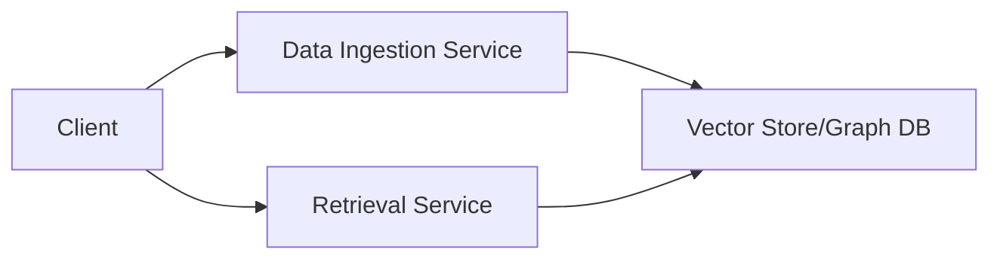

# API Documentation

## Service Architecture

The Context-Aware RAG system consists of two main services:
1. **Data Ingestion Service** (default port: 8001) - Handles document ingestion and processing
2. **Retrieval Service** (default port: 8000) - Handles question answering and document retrieval



## Service Initialization

Both services must be initialized before use with the same UUID to ensure proper communication.

### Initialize Data Ingestion Service

```bash
curl -X POST http://localhost:8001/init \
  -H "Content-Type: application/json" \
  -d '{
    "config_path": "/app/config/config.yaml",
    "uuid": "your_session_uuid"
  }'
```

### Initialize Retrieval Service

```bash
curl -X POST http://localhost:8000/init \
  -H "Content-Type: application/json" \
  -d '{
    "config_path": "/app/config/config.yaml",
    "uuid": "your_session_uuid"
  }'
```

**Important**: Use the same UUID for both services to ensure they can access the same context.

## Adding Documents

### Endpoint: POST /add_doc

Adds a document to the system for later retrieval.

#### Request Format

```json
{
  "document": "Your document text here",
  "doc_index": 1,
  "doc_metadata": {
    "streamId": "unique_stream_id",
    "chunkIdx": 1,
    "file": "source_file.txt",
    "is_first": true,  // Required for first document in a stream
    "is_last": false,  // Required for last document in a stream
    "uuid": "your_session_uuid"
  }
}
```

#### Metadata Flags

- `is_first`: Set to `true` for the first document in a stream
- `is_last`: Set to `true` for the last document in a stream
- At least one document must have `is_first: true` and one must have `is_last: true`

#### Example: Adding Multiple Documents

1. First document:
```bash
curl -X POST http://localhost:8001/add_doc \
  -H "Content-Type: application/json" \
  -d '{
    "document": "First document content",
    "doc_index": 1,
    "doc_metadata": {
      "streamId": "stream1",
      "chunkIdx": 1,
      "file": "doc.txt",
      "is_first": true,
      "is_last": false,
      "uuid": "your_session_uuid"
    }
  }'
```

2. Middle document:
```bash
curl -X POST http://localhost:8001/add_doc \
  -H "Content-Type: application/json" \
  -d '{
    "document": "Middle document content",
    "doc_index": 2,
    "doc_metadata": {
      "streamId": "stream1",
      "chunkIdx": 2,
      "file": "doc.txt",
      "uuid": "your_session_uuid"
    }
  }'
```

3. Last document:
```bash
curl -X POST http://localhost:8001/add_doc \
  -H "Content-Type: application/json" \
  -d '{
    "document": "Last document content",
    "doc_index": 3,
    "doc_metadata": {
      "streamId": "stream1",
      "chunkIdx": 3,
      "file": "doc.txt",
      "is_first": false,
      "is_last": true,
      "uuid": "your_session_uuid"
    }
  }'
```

## Querying Documents

### Endpoint: POST /call

Queries the system with questions about the ingested documents.

#### Request Format

```json
{
  "state": {
    "chat": {
      "question": "Your question here",
      "is_live": false,
      "is_last_question": false
    }
  }
}
```

#### Example Query

```bash
curl -X POST http://localhost:8000/call \
  -H "Content-Type: application/json" \
  -d '{
    "state": {
      "chat": {
        "question": "What topics are covered in the document?",
        "is_live": false,
        "is_last_question": false
      }
    }
  }'
```

## Health Checks

Both services provide health check endpoints:

```bash
# Check Data Ingestion Service health
curl http://localhost:8001/health

# Check Retrieval Service health
curl http://localhost:8000/health
```

## Common Error Messages and Solutions

1. "Context manager not initialized"
   - **Cause**: Service not initialized or wrong UUID
   - **Solution**: Initialize both services with the same UUID

2. "No context was provided"
   - **Cause**: Documents not properly ingested or wrong UUID
   - **Solution**: Verify documents were added successfully and UUIDs match

3. "Invalid request format"
   - **Cause**: Incorrect JSON structure in request
   - **Solution**: Check request format against examples above

## Best Practices

1. **Document Structure**
   - Keep documents between 100-1000 words for optimal retrieval
   - Use clear, well-formatted text
   - Include relevant metadata

2. **UUID Management**
   - Use unique UUIDs for different sessions
   - Maintain the same UUID across both services
   - Consider using timestamp-based UUIDs for easy tracking

3. **Document Indexing**
   - Use sequential indices starting from 1
   - Maintain consistent indexing within a stream
   - Include relevant metadata for better context

4. **Performance Optimization**
   - Batch similar documents together
   - Use appropriate chunk sizes
   - Monitor system resources

## Configuration

The `/app/config/config.yaml` file controls various aspects of the system:

- Vector store settings
- Model parameters
- Chunking configuration
- Logging settings


## Monitoring and Debugging

### Important Log Messages

1. Data Ingestion Service:
   - "Adding doc {index}" - Document being processed
   - "Batch {index} is full. Processing ..." - Batch processing
   - "start_pts or end_pts not found" - Missing timestamp metadata

2. Retrieval Service:
   - "Using {model} as the {type} llm" - Model initialization
   - "Setting up QnA, rag type: {type}" - RAG configuration

### Metrics

Both services expose metrics at `/metrics` endpoint:
- Request latency
- Document processing time
- Error rates
- System resource usage
